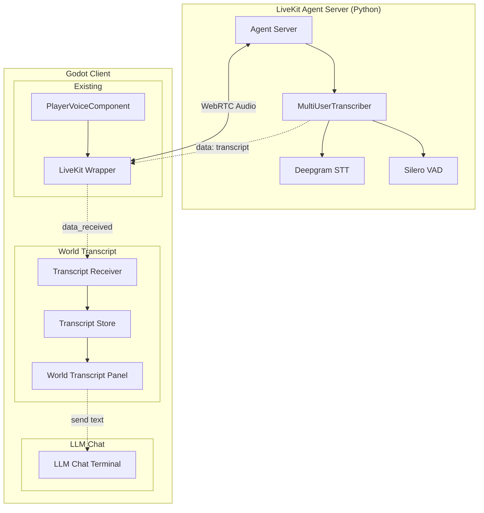

# Design Document: Voice-to-Text World Transcript

## Overview

This feature adds a World Transcript Panel that displays real-time transcriptions of all voice activity in a LiveKit room. The system uses a LiveKit Agent server running Deepgram STT (or Whisper) to transcribe audio from all participants and broadcast transcripts to the room.

Users can view the shared transcript, copy/export it, and optionally send their own transcribed speech to the LLM Chat Terminal.

**Key Architecture Decisions:**
- Server-side transcription via LiveKit Agent (no client-side STT)
- Transcripts broadcast to all participants via LiveKit data channel
- World Transcript Panel displays all room voice activity
- Integration with existing LLM Chat Terminal for sending transcripts

## Architecture



### Data Flow

1. **Audio Capture**: User speaks → `PlayerVoiceComponent` → LiveKit server
2. **Transcription**: LiveKit Agent receives audio → Silero VAD detects speech → Deepgram STT transcribes
3. **Broadcast**: Agent sends transcript JSON via `publish_data()` to all room participants
4. **Display**: Godot client receives via `data_received` signal → `TranscriptReceiverHandler` → `WorldTranscriptStore` → `WorldTranscriptPanel`
5. **LLM Integration**: User clicks "Send to LLM" → text populates LLM Chat input

## Components

### Server-Side (Python)

#### 1. TranscriberAgent

Handles transcription for a single participant.

```python
class TranscriberAgent(Agent):
    def __init__(self, *, participant_identity: str, room: rtc.Room):
        super().__init__(instructions="not-needed", stt=deepgram.STT())
        self.participant_identity = participant_identity
        self.room = room
    
    async def on_user_turn_completed(self, chat_ctx, new_message):
        transcript = new_message.text_content
        await self.room.local_participant.publish_data(
            json.dumps({
                "type": "transcript",
                "speaker_identity": self.participant_identity,
                "text": transcript,
                "timestamp": int(time.time() * 1000),
                "is_final": True
            }).encode(),
            reliable=True
        )
        raise StopResponse()
```

#### 2. MultiUserTranscriber

Manages transcription sessions for all room participants.

```python
class MultiUserTranscriber:
    def __init__(self, ctx: JobContext):
        self.ctx = ctx
        self._sessions: dict[str, AgentSession] = {}
    
    def start(self):
        self.ctx.room.on("participant_connected", self.on_participant_connected)
        self.ctx.room.on("participant_disconnected", self.on_participant_disconnected)
```

### Client-Side (GDScript)

#### 3. TranscriptReceiverHandler

Receives transcript messages from the LiveKit Agent.

```gdscript
class_name TranscriptReceiverHandler
extends Node

signal transcript_received(entry: TranscriptEntry)

var transcript_store: WorldTranscriptStore
var local_identity: String = ""

func _ready() -> void:
    var livekit = get_node_or_null("/root/LiveKitWrapper")
    if livekit:
        livekit.data_received.connect(_on_data_received)

func _on_data_received(sender_identity: String, data: String) -> void:
    var parsed = JSON.parse_string(data)
    if parsed and parsed.get("type") == "transcript":
        var entry = TranscriptEntry.new()
        entry.speaker_identity = parsed.get("speaker_identity", "")
        entry.text = parsed.get("text", "")
        entry.timestamp = parsed.get("timestamp", 0)
        entry.is_final = parsed.get("is_final", true)
        entry.is_local = (entry.speaker_identity == local_identity)
        
        if transcript_store:
            transcript_store.add_entry(entry)
        transcript_received.emit(entry)
```

#### 4. WorldTranscriptStore

Stores and manages transcript entries.

```gdscript
class_name WorldTranscriptStore
extends Node

signal entry_added(entry: TranscriptEntry)
signal entries_cleared()

const MAX_ENTRIES: int = 500

var entries: Array[TranscriptEntry] = []
var room_name: String = ""

func add_entry(entry: TranscriptEntry) -> void:
    entries.append(entry)
    _enforce_limit()
    entry_added.emit(entry)

func _enforce_limit() -> void:
    while entries.size() > MAX_ENTRIES:
        entries.pop_front()

func export_to_text() -> String:
    var lines: PackedStringArray = []
    lines.append("# World Transcript - %s" % room_name)
    lines.append("# Exported: %s\n" % Time.get_datetime_string_from_system())
    for entry in entries:
        lines.append("[%s] %s: %s" % [entry.format_time(), entry.get_display_name(), entry.text])
    return "\n".join(lines)
```

#### 5. TranscriptEntry

Data class for a single transcript entry.

```gdscript
class_name TranscriptEntry
extends RefCounted

var speaker_identity: String
var speaker_name: String  # Display name if available
var text: String
var timestamp: int  # Unix ms
var is_local: bool
var is_final: bool

func format_time() -> String:
    var dt = Time.get_datetime_dict_from_unix_time(timestamp / 1000)
    return "%02d:%02d:%02d" % [dt.hour, dt.minute, dt.second]

func get_display_name() -> String:
    return speaker_name if speaker_name else speaker_identity

func to_dict() -> Dictionary:
    return {"speaker_identity": speaker_identity, "speaker_name": speaker_name,
            "text": text, "timestamp": timestamp, "is_local": is_local, "is_final": is_final}
```

#### 6. WorldTranscriptPanel

UI panel displaying the world transcript.

```gdscript
class_name WorldTranscriptPanel
extends PanelContainer

signal send_to_llm_requested(text: String)

@onready var transcript_output: RichTextLabel
@onready var copy_button: Button
@onready var export_button: Button
@onready var clear_button: Button
@onready var status_label: Label

var transcript_store: WorldTranscriptStore
var auto_scroll: bool = true

func _on_entry_added(entry: TranscriptEntry) -> void:
    var color = "#66aaff" if entry.is_local else "#aaaaaa"
    var bbcode = "[color=#666][%s][/color] [color=%s][b]%s:[/b][/color] %s\n" % [
        entry.format_time(), color, entry.get_display_name(), entry.text]
    transcript_output.append_text(bbcode)
```

#### 7. WorldTranscriptViewport3D

3D viewport wrapper for VR display (follows existing `ui_viewport_3d.gd` pattern).

## Data Models

### Transcript Message (Server → Client)

```json
{
    "type": "transcript",
    "speaker_identity": "user123",
    "speaker_name": "John Doe",
    "text": "Hello everyone!",
    "timestamp": 1703001234567,
    "is_final": true
}
```

### TranscriptEntry Fields

| Field | Type | Description |
|-------|------|-------------|
| speaker_identity | String | LiveKit participant identity |
| speaker_name | String | Display name (optional) |
| text | String | Transcribed text |
| timestamp | int | Unix timestamp (ms) |
| is_local | bool | True if local user |
| is_final | bool | True if final transcript |

## Server Deployment

### Requirements
- Python 3.9+
- LiveKit server
- Deepgram API key

### Installation

```bash
pip install livekit-agents livekit-plugins-deepgram livekit-plugins-silero python-dotenv
```

### Environment Variables

```bash
LIVEKIT_URL=wss://your-server.livekit.cloud
LIVEKIT_API_KEY=your_key
LIVEKIT_API_SECRET=your_secret
DEEPGRAM_API_KEY=your_deepgram_key
```

### Running

```bash
python transcriber_agent.py dev    # Development
python transcriber_agent.py start  # Production
```

## Correctness Properties

*A property is a characteristic or behavior that should hold true across all valid executions of a system-essentially, a formal statement about what the system should do. Properties serve as the bridge between human-readable specifications and machine-verifiable correctness guarantees.*

### Property 1: Transcript message parsing
*For any* valid transcript JSON message received via data channel, the system should create a TranscriptEntry with all fields correctly populated.
**Validates: Requirements 5.1, 5.2**

### Property 2: Transcript entry ordering
*For any* sequence of transcript entries, they should be displayed in chronological order by timestamp.
**Validates: Requirements 5.3**

### Property 3: Transcript entry limit enforcement
*For any* WorldTranscriptStore with more than 500 entries, the oldest entries should be removed to maintain exactly 500 or fewer entries.
**Validates: Requirements 5.5**

### Property 4: Export metadata completeness
*For any* transcript export, the output should contain room name, date, and all entry timestamps with speaker names.
**Validates: Requirements 6.3**

### Property 5: Local user identification
*For any* transcript entry where speaker_identity matches the local user's identity, is_local should be true.
**Validates: Requirements 5.2**

### Property 6: Copy to clipboard
*For any* copy operation, the clipboard should contain the full transcript in readable text format.
**Validates: Requirements 6.1**

## Error Handling

### LiveKit Connection Errors
- **Room not connected**: Show "Not connected" status, disable transcript display
- **Data channel unavailable**: Log warning, transcripts won't be received

### Transcript Parsing Errors
- **Invalid JSON**: Log error, skip message
- **Missing required fields**: Use defaults, log warning

### Server Errors
- **Agent not running**: Transcripts won't be generated (graceful degradation)
- **STT API error**: Agent logs error, no transcript sent

## Testing Strategy

### Unit Tests (GUT)
1. **TranscriptEntry** - to_dict/from_dict round-trip, format_time
2. **WorldTranscriptStore** - add_entry, limit enforcement, export
3. **TranscriptReceiverHandler** - JSON parsing, entry creation

### Property-Based Tests
- Entry limit enforcement with random entry counts
- Export format consistency with random entries
- Timestamp ordering preservation

### Integration Tests
1. **End-to-end flow**: Mock LiveKit data_received → verify panel display
2. **LLM integration**: Send transcript text → verify in LLM input field
